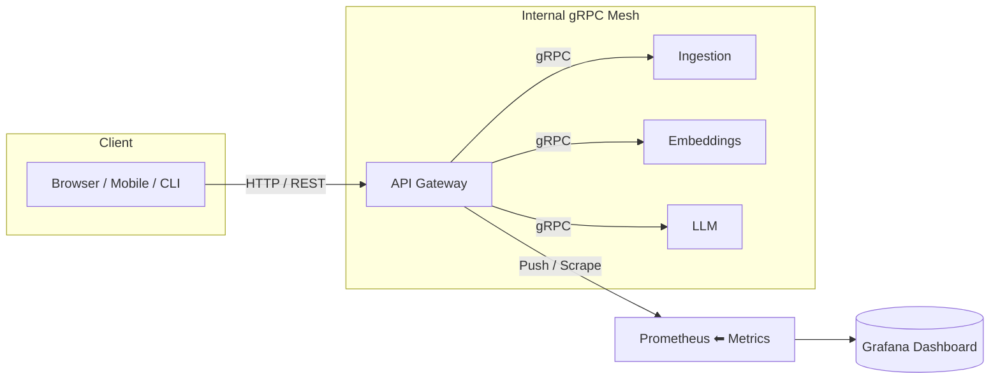

# RAG-Project – Retrieval-Augmented-Generation Micro-service Suite

> End-to-end platform that ingests raw data, chunks & embeds it, stores vectors, routes LLM queries and collects rich, cross-service metrics – all orchestrated through a single API Gateway.

---

## 📐 High-level Architecture



## 📋 Project Status

### ✅ Completed Features
- **API Gateway**
  - REST API endpoints
  - gRPC client stubs
  - Basic metrics collection
  - Health monitoring
  - CSV export functionality

- **LLM Service**
  - Multiple model support (Flan-T5 series)
  - Prompt engineering system
  - Response generation
  - Basic metrics collection
  - Model switching capability

- **UI Service**
  - Flet-based interface
  - Query submission
  - Response display
  - Basic metrics visualization
  - CSV export

### 🚧 In Progress
- **Embeddings Service**
  - Vector database integration
  - Multiple DB support (PostgreSQL, ClickHouse, Cassandra, OpenSearch (ElasticSearch) )
  - Similarity search optimization
  - Batch processing capabilities

- **Ingestion Service**
  - Automating the ingestion pipeline

### 📅 Upcoming Features
- **API Gateway**
  - Advanced metrics aggregation
  - Prometheus & Grafana


- **Embeddings Service**
  - optimization

- **Ingestion Service**


- **LLM Service**
  - Streaming responses
  - Model fine-tuning support
  - Advanced prompt templates
  - Context window optimization

- **UI Service**
  - Real-time metrics dashboard
  - Advanced visualization
  - User preferences

### ⚠️ Deprecated/Removed
- **Legacy Components**
  - Tkinter UI (replaced by Flet)

## 🏗️ Core Services

### API Gateway
- **Purpose**: Central entry point and metrics aggregation
- **Tech Stack**: Python 3.11, Flask, gRPC
- **Key Features**:
  - REST API endpoints
  - gRPC client stubs
  - Metrics collection and export
  - Health monitoring

### Ingestion Service
- **Purpose**: Data acquisition and preprocessing
- **Tech Stack**: FastAPI, boto3
- **Features**:
  - PDF processing to plain text
  - S3 integration


### Embeddings Service
- **Purpose**: Vector embeddings and storage
- **Tech Stack**: FastAPI, langchain, FAISS/ChromaDB
- **Features**:
  - Text chunking
  - Embedding generation
  - Vector storage

### LLM Service
- **Purpose**: Query processing and response generation
- **Tech Stack**: Transformers, sentence-transformers
- **Features**:
  - Multiple model support
  - Prompt engineering
  - Response generation
  - Metrics collection
  - Model switching

### UI Service
- **Purpose**: User interface for system interaction
- **Tech Stack**: Flet/Tkinter
- **Features**:
  - Query interface
  - Metrics visualization
  - Response display
  - Export capabilities

## 📥 Data Pipeline

### 1. Ingestion
```python
# Example: Web page ingestion
from ingestion.web import WebIngester
ingester = WebIngester()
content = ingester.fetch("https://example.com")
```

### 2. Processing
```python
# Example: Text chunking
from ingestion.chunking import TextChunker
chunker = TextChunker(
    chunk_size=1000,
    chunk_overlap=200,
    separator="\n"
)
chunks = chunker.split(content)
```

### 3. Embedding
```python
# Example: Vector generation
from embeddings.vectorizer import Vectorizer
vectorizer = Vectorizer(model="sentence-transformers/all-MiniLM-L6-v2")
vectors = vectorizer.embed(chunks)
```

### 4. Query Processing
```python
# Example: RAG query
from rag.query import process_query
response, metrics = process_query(
    user_query="What is RAG?",
    model_name="google/flan-t5-large",
    temperature=0.7,
    max_tokens=200,
    top_k=5
)
```

## 📊 Metrics & Monitoring

### Prometheus Metrics
- Query latency
- Token usage
- Vector operations
- Service health
- Resource utilization

### Custom RAG Metrics
- Stage durations
- Pipeline interactions
- Success rates
- Error tracking
- Model performance

### Export Formats
- CSV exports

## 🚀 Getting Started

### Prerequisites
- Docker and Docker Compose
- Python 3.11+
- Poetry (for local development)

### Quick Start
```bash
# 1. Build
docker compose build

# 2. Launch
docker compose up -d

# 3. Access Services
open http://localhost:8000   # API Gateway
```

### Development Setup
```bash
# Install dependencies
cd <service-directory>
poetry install

# Run tests
poetry run pytest

# Start service
# For API Gateway:
poetry run python -m api_gateway.server

# For UI:
cd UI
poetry run python -m rag.flet_gui_connected

# For LLM Service:
cd LLM
poetry run python -m rag.main

# For Embeddings Service:
cd embeddings
poetry run python -m rag.server

# For Ingestion Service:
cd Ingestion
poetry run python -m grpc.server
```

## 📝 Service-Specific Documentation

Each service has its own README with detailed information:
- `API_Gateway/README.md` - Gateway configuration and metrics
- `Ingestion/README.md` - Data ingestion pipeline
- `embeddings/README.md` - Vector storage and search
- `LLM/README.md` - Model management and prompting
- `UI/README.md` - Interface customization

## 🔧 Configuration

### Environment Variables
- `DEFAULT_LLM_MODEL` - Default language model
- `VECTOR_DB_TYPE` - Vector database selection
- `API_GATEWAY_PORT` - Gateway port (default: 8000)
- `PROMETHEUS_PORT` - Metrics port (default: 9090)

### Model Configuration
```python
MODEL_CONFIG = {
    "default_model": "google/flan-t5-large",
    "default_temperature": 0.7,
    "default_max_tokens": 200,
    "default_top_k": 5
}
```

## 🤝 Contributing

1. Fork the repository
2. Create a feature branch
3. Add tests for new functionality
4. Update documentation
5. Submit a pull request

## 📜 License
MIT

# RAG System with Modular Prompt Engineering

This project implements a Retrieval-Augmented Generation (RAG) system with a focus on modular and extensible prompt engineering.

## Architecture

The system is built with a microservices architecture:
- API Gateway: Entry point for all requests
- LLM Service: Handles language model interactions
- Embeddings Service: Manages vector embeddings
- UI: Web interface for interacting with the system

## Prompt Engineering

### Prompt Management System

The system uses a dedicated `PromptManager` class to handle all aspects of prompt engineering:

```python
from rag.prompt_manager import prompt_manager

# Format a prompt for a specific model
formatted_prompt = prompt_manager.format_prompt(
    query="What is RAG?",
    model_name="google/flan-t5-large"
)
```

### Model-Specific Templates

The system supports different prompt templates for various model types:

1. **Instruct Models** (e.g., Mistral, Llama):
   ```python
   "<s>[INST] {query} [/INST]"
   ```

2. **Flan-T5 Models**:
   ```python
   "Question: {query}\nAnswer:"
   ```

3. **Default Template**:
   ```python
   "{query}"
   ```

### Query Validation

The system includes robust query validation:
- Empty query detection
- Length limits (1000 characters)
- Model-specific requirements

### Model Requirements

Each model's capabilities are tracked:
- Maximum input length
- Streaming support
- System prompt requirements
- Default parameters (temperature, max_tokens, top_k)

## Usage

### Basic Query

```python
from rag.query import process_query

response, metrics = process_query(
    user_query="What is RAG?",
    model_name="google/flan-t5-large",
    temperature=0.7,
    max_tokens=200,
    top_k=5
)
```

### Metrics

The system tracks various metrics:
- Vector search latency
- LLM processing latency
- Total processing time
- Tokens used
- Model-specific requirements

## Configuration

Model settings are configured in `config.py`:
```python
MODEL_CONFIG = {
    "default_model": "google/flan-t5-large",
    "default_temperature": 0.7,
    "default_max_tokens": 200,
    "default_top_k": 5,
    "supported_models": [
        "google/flan-t5-large",
        "google/flan-t5-base",
        "google/flan-t5-small"
    ]
}
```

## Adding New Models

To add a new model:

1. Add the model to `MODEL_CONFIG["supported_models"]`
2. Add appropriate prompt template in `prompt_manager.py`
3. Update model requirements in `get_model_requirements()`