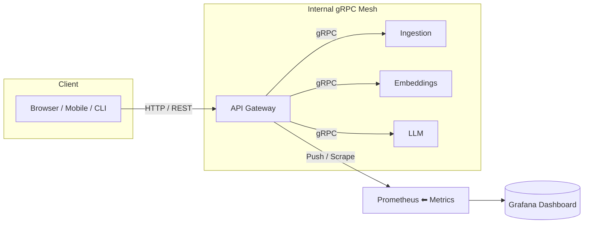

# RAG-Project – Retrieval-Augmented-Generation Micro-service Suite

> End-to-end platform that ingests raw data, chunks & embeds it, stores vectors, routes LLM queries and collects rich, cross-service metrics – all orchestrated through a single API Gateway.

---

## 📐 High-level Architecture



* **API Gateway** (Flask + gRPC client stubs)
  * Public REST entry-point
  * Delegates heavy work to domain micro-services via gRPC
  * Aggregates Prometheus + custom RAG metrics → CSV & dashboard
* **Ingestion** – acquires raw data (web, S3…) & writes to object storage
* **Embeddings** – chunks, embeds & stores vectors in FAISS / ChromaDB
* **LLM** – retrieves top-K vectors, calls the LLM and returns answers
* **UI** – optional desktop / web GUI that talks to Gateway REST API
* **Prometheus & Grafana** – infrastructure containers for monitoring

---

## 🔌 Running the entire stack

```bash
# 1. Build
docker compose build   # first run may take a while (PyPI wheels)
# 2. Launch
docker compose up -d   # -d = detached
# 3. Explore
open http://localhost:8000   # Gateway REST (Swagger coming soon)
open http://localhost:9090   # Prometheus
open http://localhost:3000   # Grafana (admin/admin)
```

> **Tip**   The first build fetches big ML wheels (transformers, faiss-cpu). We increased `POETRY_HTTP_TIMEOUT=600` and `POETRY_HTTP_RETRIES=10` in every Dockerfile, but you can also add a PyPI mirror if your network is slow.

---

## 🗂️ Repository Layout

```
API_Gateway/      – Gateway source, metrics bus, shared protos
embeddings/       – Chunk + Embed service
Ingestion/        – Raw-data ingestion service (gRPC flavour lives in Ingestion/grpc)
LLM/              – Query / LLM service (LLM/RAG)
UI/               – Optional GUI examples (Tkinter / Flet)
docker-compose.yml
prometheus.yml    – Scrape config
```

---

## 🧩 Micro-service Cheat-Sheet

| Service | Tech | gRPC Port | REST / Metrics | Docker CMD |
|---------|------|-----------|----------------|------------|
| **API Gateway** | Python 3.11 / Flask | 50051 | 8000 | `python src/api_gateway/server.py` |
| **Embeddings** | FastAPI (+ langchain, faiss) | 50052 | _TBD_ | `python -m rag.server` |
| **Ingestion** | FastAPI (+ boto3) | 50053 | _TBD_ | `python -m grpc.server` |
| **LLM** | Transformers, sentence-transformers | 50054 | _TBD_ | `python -m rag.main` |

All containers are attached to the `rag-network` bridge so they can reach each other via `{service-name}:{port}`.

---

## 📊 Metrics & Benchmarking

1. **Prometheus-style** – every service exposes `/metrics` (prometheus-client).
2. **Custom RAG metrics** – the Gateway wraps gRPC calls with decorators from `MetricsCollector` and writes detailed stage & pipeline CSVs under `API_Gateway/exports/`.
3. **Dashboard** – Gateway serves a lightweight Flask blueprint at `/api/metrics` and `/api/benchmarks` which the UI or Grafana can embed.

CSV headers:
* `stage_metrics.csv` – component, stage, duration, throughput, success …
* `population_benchmarks.csv`, `update_benchmarks.csv`, `query_benchmarks.csv`
* `pipeline_interactions.csv` – cross-component timings

---

## 🚀 Local Development

```bash
# Gateway example
cd API_Gateway
poetry install            # installs deps into host machine
poetry run pytest -v      # run unit tests
poetry run python generate_grpc.py   # regenerate stubs after editing protos
```

### Common Make targets (optional)
Add this to your personal `~/.bashrc` if desired:
```bash
alias dc="docker compose"
make build   # → docker compose build
make up      # → docker compose up -d
make logs    # → docker compose logs -f --tail=50
```

---

## 📝 Per-service READMEs

Each sub-folder contains its own README with:
* Purpose & responsibilities
* gRPC API snippet
* How to run tests / server locally
* Environment variables

---

## 📜 License
MIT
