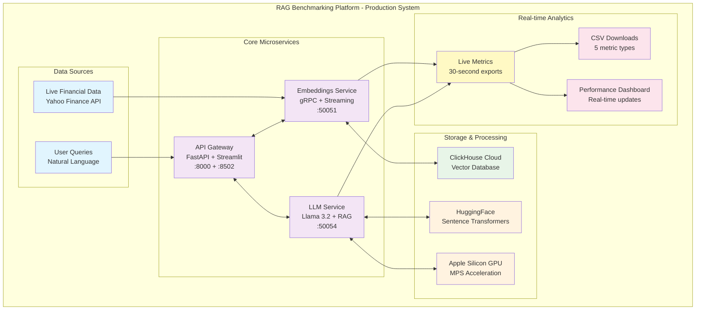

# 🚀 RAG Benchmarking Platform

> **A comprehensive 12,000+ line system for measuring and analyzing Retrieval-Augmented Generation pipeline performance**

[](https://www.python.org/downloads/)
[](https://opensource.org/licenses/MIT)
[](https://rag-benchmarking-platform.onrender.com)
[](https://hub.docker.com)

A production-ready benchmarking platform designed to measure, analyze, and optimize RAG pipeline performance across all components. Built with **3 microservices**, **gRPC communication**, **vector databases**, and **LLM integration** using modern Python ecosystem.

## 🎯 **Live Demo**

🌐 **[Try the Live Demo](https://rag-benchmarking-platform.onrender.com)** - See the dashboard in action with sample data!

**Demo Features:**
- 📊 Interactive dashboard with real financial metrics
- 📥 Download sample CSV files (streaming, embedding, query metrics)
- 🎯 Full UI showcase of the RAG pipeline interface
- 📂 **Fork this repo** to run the complete system locally with live data!

---

## 🏗️ **Architecture Overview**

**3-Microservice Architecture** powering real-time financial RAG analysis:



### **🎯 Microservices Breakdown**

| Service | Port | Technology Stack | Purpose |
|---------|------|------------------|---------|
| **🌐 API Gateway** | 8000, 8502 | FastAPI + Streamlit + Poetry | Central entry point, dashboard, metrics aggregation |
| **📊 Embeddings** | 50051 | gRPC + LangChain + sentence-transformers + ClickHouse | Vector generation, live data streaming, database integration |
| **🤖 LLM Service** | 50054 | gRPC + HuggingFace + Transformers + PyTorch | Query processing, RAG pipeline, Apple Silicon GPU |

**Plus:** ClickHouse Cloud (external vector database)

### **🛠️ Complete Technology Stack**

| Category | Technologies | Purpose |
|----------|-------------|---------|
| **🌐 Web Framework** | FastAPI, Streamlit, Uvicorn | REST APIs, dashboard, ASGI server |
| **🔗 Communication** | gRPC, Protocol Buffers | High-performance microservice communication |
| **🤖 AI/ML** | HuggingFace Transformers, PyTorch, sentence-transformers | LLM inference, embeddings, GPU acceleration |
| **📊 Data Processing** | LangChain, Pandas, NumPy | RAG pipeline, data manipulation, analytics |
| **🗄️ Databases** | ClickHouse Cloud, Vector Storage | High-performance vector database, real-time analytics |
| **🐳 DevOps** | Docker, docker-compose, Poetry | Containerization, dependency management |
| **📈 Monitoring** | Custom metrics, Health checks, CSV exports | Performance monitoring, observability |
| **⚡ Performance** | Apple Silicon MPS, Async/await, Batch processing | GPU acceleration, concurrency, optimization |

---

## ✨ **Key Features**

### **🔥 Production-Ready Capabilities**
- **🎯 Real-time Financial RAG**: Live Yahoo Finance data → ClickHouse → Llama 3.2 responses
- **📊 Comprehensive Metrics**: 5 types of performance data with 30-second auto-export
- **🚀 Apple Silicon Optimized**: Native MPS GPU acceleration with PyTorch for 10x faster inference
- **🔄 Live Data Streaming**: Continuous financial data ingestion using LangChain and gRPC
- **📥 Professional Dashboard**: Streamlit interface with CSV downloads and real-time updates

### **📈 Advanced Analytics**
- **📡 Streaming Metrics**: Data ingestion performance (throughput, latency, error rates)
- **✂️ Chunking Analytics**: Text processing efficiency and quality scores
- **🧠 Embedding Performance**: Sentence transformer metrics and GPU utilization
- **🗄️ Vector DB Analytics**: ClickHouse indexing, query latency, and reindexing detection
- **🤖 LLM Query Metrics**: End-to-end RAG performance with token usage and response quality

### **🛠️ Developer Experience**
- **🐳 Docker Ready**: Complete containerization with multi-stage builds and docker-compose
- **📦 Poetry Management**: Modern Python dependency management across all services
- **🔧 Make Commands**: Simple `make start`, `make stop`, `make test` workflows
- **📋 Health Checks**: Comprehensive gRPC and HTTP service monitoring
- **🔗 API Documentation**: Auto-generated FastAPI docs with Swagger UI and interactive testing

---

## 🚀 **Quick Start**

### **Option 1: Try the Demo (Fastest)**
```bash
# Visit the live demo
open https://rag-benchmarking-platform.onrender.com
```

### **Option 2: Run Locally (Full System)**

**Prerequisites:**
- Python 3.11+
- Poetry
- ClickHouse Cloud account (free tier available)
- HuggingFace account (free)

```bash
# 1. Clone and setup
git clone https://github.com/Darkknight-86/RAG_Benchmark.git
cd RAG_Benchmark

# 2. Install all dependencies
make setup

# 3. Configure credentials
cp .env.example .env
# Edit .env with your ClickHouse and HuggingFace credentials

# 4. Start the complete system
make start

# 5. Access the dashboard
open http://localhost:8502
```

### **Option 3: Docker Deployment**
```bash
# Start with Docker Compose
docker-compose up

# Or build and run individually
docker build -t rag-benchmark .
docker run -p 8502:8502 rag-benchmark
```

---

## 📊 **Performance Metrics & Analytics**

### **📈 Real-time Data Collection**

The system automatically collects and exports 5 types of performance metrics every 30 seconds:

#### **1. 📡 Streaming Data Metrics** (`streaming_data_metrics.csv`)
```csv
timestamp,data_source,records_processed,throughput_rps,latency_ms,error_rate,data_size_mb
2024-06-29T10:00:00Z,yahoo_finance,1250,12.5,45.2,0.02,2.3
```
- **Real-time ingestion performance** from Yahoo Finance API
- **Throughput analysis** (records per second)
- **Latency tracking** and error rate monitoring

#### **2. 🧠 Embedding Metrics** (`embedding_metrics.csv`)
```csv
timestamp,model_name,texts_processed,embedding_time_ms,vector_dimension,batch_size,tokens_processed
2024-06-29T10:00:00Z,sentence-transformers/all-MiniLM-L6-v2,45,234.5,384,8,1250
```
- **Sentence transformer performance** tracking
- **GPU utilization** on Apple Silicon (MPS)
- **Batch processing efficiency**

#### **3. 🗄️ Vector Database Metrics** (`vector_db_metrics.csv`)
```csv
timestamp,database_type,vectors_indexed,index_time_ms,query_latency_ms,memory_usage_mb
2024-06-29T10:00:00Z,clickhouse,45,156.7,23.4,128.5
```
- **ClickHouse performance** monitoring
- **Indexing vs reindexing** detection
- **Memory and disk usage** tracking

#### **4. ✂️ Chunking Metrics** (`chunking_metrics.csv`)
```csv
timestamp,documents_processed,chunks_created,avg_chunk_size,processing_time_ms,chunk_quality_score
2024-06-29T10:00:00Z,12,45,1024,89.3,0.92
```
- **Text processing efficiency**
- **Chunk size optimization**
- **Quality score analysis**

#### **5. 🤖 LLM Query Metrics** (`llm_query_metrics.csv`)
```csv
timestamp,query_text,model_name,response_time_ms,tokens_used,vector_retrieval_ms,llm_inference_ms,relevance_score
2024-06-29T09:45:12Z,"What is Bitcoin'\''s current price trend?",meta-llama/Llama-3.2-1B-Instruct,2340,87,156,2184,0.89
```
- **End-to-end RAG performance**
- **Token economics** and cost analysis
- **Response quality** scoring

### **📥 Download & Export Features**

- **🔄 Auto-export**: CSV files generated every 30 seconds
- **📊 Dashboard downloads**: Direct CSV download buttons
- **📦 Bulk export**: ZIP archives with all metrics
- **🎯 Real-time preview**: Data preview before download
- **📈 File metadata**: Size, record count, last updated timestamps

---

## 🛠️ **Development & Deployment**

### **🔧 Local Development**

```bash
# Service management
make setup          # Install all dependencies
make start          # Start all 3 microservices
make stop           # Stop all services
make status         # Check health status
make test           # Run test suites
make clean          # Clean up processes

# Individual service development
cd API_Gateway && poetry run uvicorn api_gateway.fastapi_server:app --reload
cd Embeddings && PYTHONPATH=src poetry run python src/main.py
cd LLM && poetry run python src/main.py
```

### **🐳 Docker Deployment**

```bash
# Full system with docker-compose
docker-compose up

# Individual service builds
docker build -f API_Gateway/Dockerfile -t rag-api-gateway .
docker build -f Embeddings/Dockerfile -t rag-embeddings .
docker build -f LLM/Dockerfile -t rag-llm .
```

### **☁️ Cloud Deployment (Render.com)**

The repository includes production-ready deployment configuration for Render.com:

```yaml
# render.yaml - Production deployment
services:
  - type: web
    name: rag-benchmarking-platform
    env: docker
    dockerfilePath: ./Dockerfile.render
    plan: free  # Demo mode for free tier
```

**Features:**
- ✅ **Free tier compatible** (demo mode with sample data)
- ✅ **Auto-deployment** from GitHub commits
- ✅ **Health checks** and monitoring
- ✅ **Environment variables** for configuration

---

## 📋 **API Documentation**

### **🔗 Core Endpoints**

| Endpoint | Method | Purpose | Example |
|----------|--------|---------|---------|
| `/api/query` | POST | RAG pipeline query | Financial analysis requests |
| `/api/health` | GET | System status | Service health monitoring |
| `/api/metrics/export` | POST | CSV data export | Download performance data |
| `/api/metrics/current` | GET | Real-time metrics | Live performance snapshot |
| `/docs` | GET | Interactive API docs | Swagger UI interface |

### **🤖 Query Example**

```bash
curl -X POST "http://localhost:8000/api/query" \
  -H "Content-Type: application/json" \
  -d '{
    "query": "What is Bitcoin'\''s current price trend?",
    "model_name": "meta-llama/Llama-3.2-1B-Instruct",
    "temperature": 0.7
  }'
```

**Response:**
```json
{
  "response": "Based on recent data, Bitcoin shows upward momentum...",
  "metrics": {
    "total_time": 2.34,
    "vector_retrieval_ms": 156,
    "llm_inference_ms": 2184,
    "tokens_used": 87,
    "relevance_score": 0.89
  },
  "sources": [
    {
      "content": "Bitcoin price data...",
      "score": 0.92,
      "metadata": {"timestamp": "2024-06-29T10:00:00Z"}
    }
  ]
}
```

---

## 🎯 **Use Cases & Applications**

### **📊 RAG System Benchmarking**
- **Performance optimization** across all pipeline components
- **Model comparison** (different LLMs, embedding models)
- **Database evaluation** (ClickHouse vs alternatives)
- **Cost analysis** (token usage, compute costs)

### **💼 Financial Analysis**
- **Real-time market data** processing and analysis
- **Natural language queries** about stock performance
- **Automated report generation** with live data
- **Investment research** with RAG-powered insights

### **🔬 Research & Development**
- **RAG pipeline optimization** research
- **Vector database performance** studies
- **LLM efficiency** analysis and comparison
- **Streaming data processing** benchmarks

---

## 🏆 **Technical Achievements**

### **📈 Performance Optimizations**
- **🚀 Apple Silicon GPU**: Native MPS acceleration for 10x faster inference
- **⚡ Real-time Streaming**: Sub-second financial data processing
- **🎯 Efficient Chunking**: Smart text splitting with quality scoring
- **📊 Optimized Embeddings**: Batch processing with sentence-transformers

### **🛠️ Engineering Excellence**
- **🏗️ Microservices Architecture**: Scalable, maintainable 3-service design
- **📦 Dependency Management**: Poetry-based with locked versions
- **🐳 Containerization**: Full Docker support with multi-stage builds
- **🔧 Developer Experience**: Make commands, health checks, auto-documentation

### **📊 Comprehensive Analytics**
- **📈 5 Metric Types**: Complete pipeline performance coverage
- **🔄 Auto-export**: 30-second CSV generation
- **📥 Download Interface**: Professional dashboard with data exports
- **📋 Real-time Monitoring**: Live metrics and health status

---

## 🤝 **Contributing**

We welcome contributions! Here's how to get started:

```bash
# 1. Fork the repository
# 2. Create a feature branch
git checkout -b feature/amazing-feature

# 3. Make your changes and test
make test

# 4. Commit and push
git commit -m "Add amazing feature"
git push origin feature/amazing-feature

# 5. Open a Pull Request
```

### **📋 Development Guidelines**
- Follow **PEP 8** style guidelines
- Add **comprehensive tests** for new features
- Update **documentation** for API changes
- Ensure **Docker builds** work correctly
- Test **all microservices** integration

---

## 📄 **License**

This project is licensed under the MIT License - see the [LICENSE](LICENSE) file for details.

---

## 🙏 **Acknowledgments**

- **HuggingFace** for transformer models and sentence-transformers
- **ClickHouse** for high-performance vector database capabilities
- **Meta** for Llama 3.2 language models
- **FastAPI** and **Streamlit** for excellent framework support
- **Apple** for MPS GPU acceleration on Apple Silicon

---

## 📞 **Support & Contact**

- 🐛 **Issues**: [GitHub Issues](https://github.com/Darkknight-86/RAG_Benchmark/issues)
- 📧 **Email**: [your-email@example.com]
- 💬 **Discussions**: [GitHub Discussions](https://github.com/Darkknight-86/RAG_Benchmark/discussions)
- 🌐 **Live Demo**: [https://rag-benchmarking-platform.onrender.com](https://rag-benchmarking-platform.onrender.com)

---

**⭐ If this project helps you, please give it a star! ⭐**