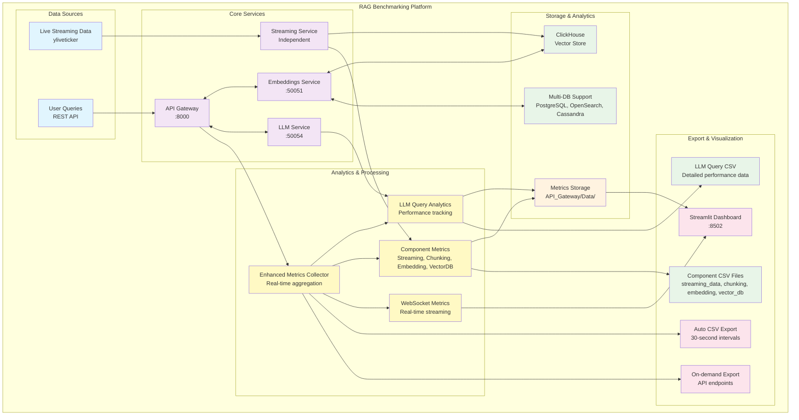

# RAG Benchmarking Platform

> **Comprehensive Retrieval-Augmented Generation Performance Measurement & Analytics System**

[](https://www.python.org/downloads/)
[](https://opensource.org/licenses/MIT)
[](docs/DATABASE_SUPPORT.md)

A production-ready benchmarking platform designed to measure, analyze, and optimize Retrieval-Augmented Generation (RAG) pipeline performance across all components. Features real-time metrics collection, component-specific performance tracking, and comprehensive analytics.

## 🎯 **Overview**

**RAG_Benchmark** provides comprehensive performance measurement for RAG systems using a modern microservices architecture. The platform tracks performance across data ingestion, text chunking, embedding generation, vector storage, and LLM query processing.

### **Key Features**

- 🔍 **Component-Specific Benchmarking** - Individual performance tracking for each RAG pipeline stage
- 📊 **Real-time Metrics Collection** - Live performance data with 30-second auto-export
- 🗄️ **Advanced Vector Database Analysis** - ClickHouse MergeTree operation monitoring with reindexing detection
- 📈 **Analytics** - CSV exports with detailed performance breakdowns
- 🎯 **Multi-Database Support** - Configurable benchmarking across ClickHouse, PostgreSQL, OpenSearch, Cassandra (to be fully implemented)


---

## 🏗️ **Architecture**



### **Microservices**

| Service | Port | Purpose | Technology |
|---------|------|---------|------------|
| **API Gateway** | 8000 | Central entry point, metrics aggregation | FastAPI, Python 3.11+ |
| **Embeddings Service** | 50051 | Vector generation and storage benchmarking | gRPC, LangChain, sentence-transformers |
| **LLM Service** | 50054 | Query processing and response generation | gRPC, Transformers |
| **Streaming Service** | Independent | Real-time data processing benchmarking | Async Python, yliveticker |
| **Dashboard** | 8502 | Performance visualization and analysis | Streamlit |

---

## 📊 **Benchmarking Capabilities**

### **Component-Specific Metrics**

The platform provides detailed performance measurement for each RAG pipeline component:

#### **📡 Data Streaming Benchmarks** (`streaming_data_metrics.csv`)
- **Ingestion Latency**: Real-time data processing performance
- **Throughput Analysis**: Bytes per second processing rates
- **Success Rate Tracking**: Continuous reliability measurement
- **Data Size Analysis**: Per-record processing efficiency

#### **✂️ Text Chunking Benchmarks** (`chunking_metrics.csv`)
- **Chunking Latency**: Text splitting performance timing
- **Efficiency Ratios**: Original text to chunk conversion rates
- **Size Variance**: Chunk size consistency analysis
- **Configuration Impact**: Performance across different parameters

#### **🧠 Embedding Model Benchmarks** (`embedding_metrics.csv`)
- **Model Latency**: Inference time across different text lengths
- **Throughput Measurement**: Vectors generated per second
- **Token Processing**: Processing efficiency analysis
- **Model Comparison**: Performance across different embedding models

#### **🗄️ Vector Database Benchmarks** (`vector_db_metrics.csv`)
- **Operation Classification**: Automatic categorization (indexing/reindexing)
- **Reindexing Detection**: ClickHouse MergeTree optimization monitoring
- **Performance Tiers**: Automated latency classification (excellent/good/slow)
- **Throughput Analysis**: Records processed per second

#### **🧠 LLM Query Analytics** (`LLM_query_performance_*.csv`)
- **Query Processing Metrics**: End-to-end RAG pipeline performance
- **Response Quality Tracking**: Token usage and generation efficiency
- **Model Performance Analysis**: Latency comparison across different LLM models
- **Real-time Analytics**: WebSocket streaming of live query metrics
- **Historical Performance**: Comprehensive query history with full context

**LLM Analytics Columns:**
- `timestamp` - ISO format query processing time
- `query_type` - Classification (general/financial/domain-specific)
- `query` - Full user query text (truncated for storage)
- `ticker` - Financial symbol (if applicable)
- `response` - Generated response (truncated for storage)
- `total_time_seconds` - Complete pipeline latency
- `vector_latency_seconds` - Vector database retrieval time
- `llm_latency_seconds` - Language model inference time
- `tokens_used` - Total token consumption
- `model_name` - LLM model identifier
- `status` - Success/error status

### **Advanced ClickHouse Monitoring**

| Operation Type | Latency Range | Frequency | Description |
|----------------|---------------|-----------|-------------|
| `indexing` | 50-200ms | Continuous | Standard vector insertions |
| `background_merge` | 500-2000ms | Every few hours | Automatic ClickHouse optimization |
| `manual_optimize` | 2000-10000ms | Manual/scheduled | OPTIMIZE TABLE operations |
| `schema_reindex` | 1000-5000ms | Rare | Schema change reindexing |

### **Advanced LLM Query Analytics**

#### **Real-time Performance Monitoring**
- **WebSocket Streaming**: Live metrics broadcast to connected dashboards
- **Auto-Export System**: Continuous CSV generation every 30 seconds
- **Performance Classification**: Automatic categorization of query complexity
- **Model Comparison**: Side-by-side analysis across different LLM models

#### **Analytics Features**
| Feature | Description | Export Format |
|---------|-------------|---------------|
| **Query History** | Complete log of all processed queries | CSV with full metadata |
| **Performance Trends** | Latency patterns over time | Time-series data |
| **Token Economics** | Cost analysis and usage optimization | Token usage breakdowns |
| **Error Analysis** | Failed query tracking and root cause | Error logs with context |
| **Model Benchmarking** | A/B testing across different models | Comparative performance data |

#### **Export Endpoints**
```bash
# Export recent LLM query analytics
POST /api/metrics/export
{
  "export_type": "queries",
  "minutes": 60
}

# Real-time metrics stream
GET /api/metrics/current
WebSocket: ws://localhost:8000/ws/metrics
```

---

## 🚀 **Quick Start**

### **Prerequisites**

- **Python 3.11+** (required for all services)
- **Poetry** (dependency management)
- **ClickHouse Cloud** account or self-hosted instance
- **Docker** (optional, for containerized deployment)

### **Installation**

```bash
# 1. Clone the repository
git clone https://github.com/yourusername/RAG_Benchmark.git
cd RAG_Benchmark

# 2. Set up all services and dependencies
make setup

# 3. Configure environment variables
cp .env.example .env
# Edit .env with your ClickHouse credentials

# 4. Start the complete benchmarking platform
make start

# 5. Access the dashboard
open http://localhost:8502
```

### **Environment Configuration**

Create a `.env` file with your ClickHouse configuration:

```env
# ClickHouse Configuration
CLICKHOUSE_HOST=your-clickhouse-host
CLICKHOUSE_PORT=8443
CLICKHOUSE_USER=your-username
CLICKHOUSE_PASSWORD=your-password
CLICKHOUSE_SECURE=true

# Multi-Database Benchmarking (optional)
STREAMING_DB_ADAPTERS=clickhouse
MAIN_DB_ADAPTERS=clickhouse
```

### **Verification**

```bash
# Check system health
make status

# View real-time metrics
curl http://localhost:8000/api/health

# Access interactive API documentation
open http://localhost:8000/docs
```

---

## 📈 **Usage**

### **Benchmarking RAG Queries**

```bash
# Benchmark a complete RAG pipeline
curl -X POST "http://localhost:8000/api/query" \
  -H "Content-Type: application/json" \
  -d '{
    "query": "What are the key benefits of vector databases?",
    "model_name": "google/flan-t5-small",
    "temperature": 0.7,
    "top_k": 5
  }'

# Response includes comprehensive metrics:
# {
#   "response": "Vector databases provide...",
#   "metrics": {
#     "vector_latency": 0.137,
#     "llm_latency": 2.114,
#     "total_time": 2.257,
#     "tokens_used": 7,
#     "model_name": "google/flan-t5-small"
#   }
# }
```

### **LLM Query Analytics & Export**

```bash
# Export comprehensive LLM query performance metrics
curl -X POST "http://localhost:8000/api/metrics/export" \
  -H "Content-Type: application/json" \
  -d '{"export_type": "queries", "minutes": 60}'

# Result: CSV download with columns:
# timestamp, query_type, query, ticker, response, total_time_seconds,
# vector_latency_seconds, llm_latency_seconds, tokens_used, model_name, status
```

**Sample Analytics Output:**
```csv
timestamp,query_type,query,ticker,response,total_time_seconds,vector_latency_seconds,llm_latency_seconds,tokens_used,model_name,status
2024-01-15T10:30:45,financial,"What's the trend for Tesla?",TSLA,"Tesla stock shows upward momentum...",2.157,0.143,2.014,45,google/flan-t5-small,success
2024-01-15T10:31:12,general,"Explain vector databases","","Vector databases are specialized...",1.892,0.089,1.803,38,google/flan-t5-small,success
```

### **Real-time Analytics Access**

```bash
# Get current metrics snapshot
curl -X GET "http://localhost:8000/api/metrics/current"

# WebSocket connection for live metrics
wscat -c ws://localhost:8000/ws/metrics

# Response includes:
# {
#   "type": "current_metrics",
#   "data": {
#     "query_count": 1247,
#     "avg_total_time": 2.134,
#     "avg_llm_latency": 1.876,
#     "avg_vector_latency": 0.258,
#     "success_rate": 0.994,
#     "tokens_per_minute": 2847
#   },
#   "timestamp": 1705312845.123
# }
```

### **Real-time Metrics Access**

```bash
# Unified metrics data location (automated export every 30 seconds):
API_Gateway/Data/
├── streaming_data_metrics.csv     # Live data ingestion benchmarks
├── chunking_metrics.csv           # Text processing performance
├── embedding_metrics.csv          # AI model benchmarks
├── vector_db_metrics.csv          # Database operation metrics
└── LLM_query_performance_*.csv    # LLM query analytics (on-demand)
```

**Unified Metrics System:**
- **Single Collector**: `enhanced_metrics.py` handles all metrics collection
- **Automated Export**: CSV generation every 30 seconds
- **Real-time Streaming**: WebSocket broadcasting for live dashboards
- **Consolidated Analytics**: All performance data in one system

---

## 🛠️ **Development**

### **Service Management**

```bash
# Development commands
make setup          # Install all dependencies
make start          # Start all services
make stop           # Stop all services
make status         # Check service health
make dashboard      # Start standalone dashboard
make clean          # Clean up processes and cache
make test           # Run test suites
```

### **Individual Service Development**

```bash
# API Gateway
cd API_Gateway
poetry install
poetry run python src/api_gateway/fastapi_server.py

# Embeddings Service (Streaming)
cd Embeddings
poetry install
PYTHONPATH=src poetry run python src/streaming.py

# Embeddings Service (gRPC)
cd Embeddings
PYTHONPATH=src poetry run python src/main.py

# LLM Service
cd LLM
poetry install
poetry run python src/main.py

# Dashboard
cd API_Gateway
poetry run streamlit run src/dashboard/enhanced_streamlit_dashboard.py --server.port 8502
```

### **Multi-Database Benchmarking**

```bash
# Single database baseline
export STREAMING_DB_ADAPTERS=clickhouse
export MAIN_DB_ADAPTERS=clickhouse

# Multi-database performance comparison
export STREAMING_DB_ADAPTERS=clickhouse,postgres
export MAIN_DB_ADAPTERS=clickhouse,opensearch

# Maximum coverage testing
export STREAMING_DB_ADAPTERS=clickhouse,postgres,opensearch,cassandra
export MAIN_DB_ADAPTERS=clickhouse
```

---

## 📊 **API Documentation**

### **Core Endpoints**

| Endpoint | Method | Purpose | Parameters |
|----------|--------|---------|------------|
| `/api/query` | POST | RAG pipeline benchmarking | `query`, `model_name`, `temperature`, `top_k` |
| `/api/health` | GET | System health check | None |
| `/api/metrics/export` | POST | Comprehensive analytics export | `export_type`, `minutes` |
| `/api/metrics/current` | GET | Real-time metrics snapshot | None |
| `/ws/metrics` | WebSocket | Live metrics streaming | None |
| `/docs` | GET | Interactive API documentation | None |

### **Analytics Endpoints**

| Endpoint | Method | Purpose | Export Type |
|----------|--------|---------|-------------|
| `/api/metrics/export` | POST | LLM query performance analytics | `"queries"` |
| `/api/metrics/export` | POST | Streaming data metrics | `"streaming"` |
| `/api/metrics/export` | POST | Component-specific metrics | `"components"` |
| `/ws/metrics` | WebSocket | Real-time performance streaming | Live JSON data |

### **Query Parameters**

```json
{
  "query": "string",           // Required: Query text
  "model_name": "string",      // Optional: LLM model (default: flan-t5-small)
  "temperature": 0.7,          // Optional: Generation temperature (0.0-1.0)
  "top_k": 5,                  // Optional: Top-K vector retrieval
  "max_tokens": 200            // Optional: Maximum response tokens
}
```

### **Response Format**

```json
{
  "response": "Generated answer text",
  "sources": [
    {
      "content": "Source document text",
      "score": 0.85,
      "metadata": {...}
    }
  ],
  "metrics": {
    "vector_latency": 0.137,
    "llm_latency": 2.114,
    "total_time": 2.257,
    "tokens_used": 7,
    "model_name": "google/flan-t5-small"
  }
}
```

---

## 📋 **Performance Benchmarks**

### **Expected Performance Ranges**

| Component | Excellent | Good | Needs Attention |
|-----------|-----------|------|-----------------|
| **Streaming Ingestion** | <2ms | 2-5ms | >5ms |
| **Text Chunking** | <1ms | 1-5ms | >5ms |
| **Embedding Generation** | <50ms | 50-200ms | >500ms |
| **Vector DB Operations** | <50ms | 50-150ms | >300ms |
| **End-to-End RAG** | <500ms | 500ms-2s | >2s |

### **LLM Query Performance Benchmarks**

| Model Type | Avg Response Time | Token Throughput | Typical Use Case |
|------------|-------------------|------------------|------------------|
| **flan-t5-small** | 1.5-2.5s | 15-25 tokens/s | General queries, development |
| **flan-t5-base** | 2.0-3.5s | 20-30 tokens/s | Production queries |
| **flan-t5-large** | 3.0-5.0s | 25-35 tokens/s | Complex reasoning |

**Performance Analytics:**
- **Query Classification**: Automatic categorization (financial/general/technical)
- **Latency Breakdown**: Vector retrieval vs. LLM inference time
- **Token Economics**: Cost per query analysis
- **Success Rate Tracking**: Error monitoring and root cause analysis
- **Model Comparison**: A/B testing analytics across models

### **Optimization Guidelines**

#### **🔍 For High Latency Issues:**
- **Streaming**: Check network connectivity and data source health
- **Embeddings**: Consider GPU acceleration or model optimization
- **Vector DB**: Monitor ClickHouse part merging and optimization schedules
- **LLM**: Optimize model size vs. accuracy trade-offs

#### **📈 For Throughput Optimization:**
- **Batch Processing**: Group operations for improved efficiency
- **Parallel Processing**: Utilize multi-core capabilities
- **Database Tuning**: Optimize ClickHouse configurations
- **Model Caching**: Implement model loading optimization

---

## 🔧 **Configuration**

### **Model Configuration**

```python
MODEL_CONFIG = {
    "default_model": "google/flan-t5-small",
    "supported_models": [
        "google/flan-t5-small",
        "google/flan-t5-base",
        "google/flan-t5-large"
    ],
    "default_temperature": 0.7,
    "default_max_tokens": 200,
    "default_top_k": 5
}
```

### **Database Configuration**

```python
DATABASE_CONFIG = {
    "clickhouse": {
        "host": "your-clickhouse-host",
        "port": 8443,
        "secure": True
    },
    "postgres": {
        "host": "localhost",
        "port": 5432
    },
    "opensearch": {
        "host": "localhost",
        "port": 9200
    }
}
```

---

## 📚 **Documentation**

- **[Project Status](docs/PROJECT_STATUS.md)** - Current implementation status and roadmap
- **[Deployment Guide](docs/DEPLOYMENT_GUIDE.md)** - Production deployment instructions
- **[RAG Pipeline Metrics Guide](docs/RAG_Pipeline_Metrics_Guide.md)** - Comprehensive metrics documentation
- **[API Gateway Benchmarking](API_Gateway/Docs/Benchmarking.md)** - Detailed benchmarking capabilities
- **[Docker Guide](docs/DockerGuide.md)** - Containerized deployment

### **Service-Specific Documentation**

- **[API Gateway](API_Gateway/README.md)** - Central gateway and metrics collection
- **[Embeddings Service](Embeddings/README.md)** - Vector generation and storage
- **[LLM Service](LLM/README.md)** - Query processing and response generation
- **[UI Dashboard](UI/README.md)** - Visualization and user interface

---

## 🧪 **Testing**

```bash
# Run all tests
make test

# Individual service tests
cd API_Gateway && poetry run pytest
cd Embeddings && poetry run pytest
cd LLM && poetry run pytest

# Integration tests
cd API_Gateway && poetry run pytest tests/test_integration.py

# Performance benchmarks
cd API_Gateway && poetry run pytest tests/test_benchmarks.py -v
```

---

## 🤝 **Contributing**

We welcome contributions! Please see our [Contributing Guidelines](CONTRIBUTING.md) for details.

### **Development Setup**

1. **Fork the repository**
2. **Create a feature branch**: `git checkout -b feature/amazing-feature`
3. **Install dependencies**: `make setup`
4. **Make your changes** with comprehensive tests
5. **Run tests**: `make test`
6. **Update documentation** as needed
7. **Submit a pull request**

### **Code Standards**

- **Python 3.11+** required
- **Black** formatting: `poetry run black .`
- **Type hints** with mypy: `poetry run mypy .`
- **Tests** for all new functionality
- **Documentation** updates for API changes

---

## 📄 **License**

This project is licensed under the MIT License - see the [LICENSE](LICENSE) file for details.

---

## 🆘 **Support**

- **🐛 Bug Reports**: [Create an issue](https://github.com/yourusername/RAG_Benchmark/issues)
- **💡 Feature Requests**: [Discussions](https://github.com/yourusername/RAG_Benchmark/discussions)
- **📖 Documentation**: Check our comprehensive [docs](docs/) directory
- **💬 Community**: Join our [Discord](https://discord.gg/rag-benchmark) (coming soon)

---

## 🌟 **Acknowledgments**

- **[LangChain](https://github.com/langchain-ai/langchain)** - RAG framework foundation
- **[ClickHouse](https://github.com/ClickHouse/ClickHouse)** - High-performance vector storage
- **[Sentence Transformers](https://github.com/UKPLab/sentence-transformers)** - Embedding models
- **[FastAPI](https://github.com/tiangolo/fastapi)** - Modern API framework
- **[Streamlit](https://github.com/streamlit/streamlit)** - Dashboard framework

---

<div align="center">

**⭐ Star this repository if you find it useful!**

[](https://github.com/yourusername/RAG_Benchmark/stargazers)
[](https://github.com/yourusername/RAG_Benchmark/network)

</div>