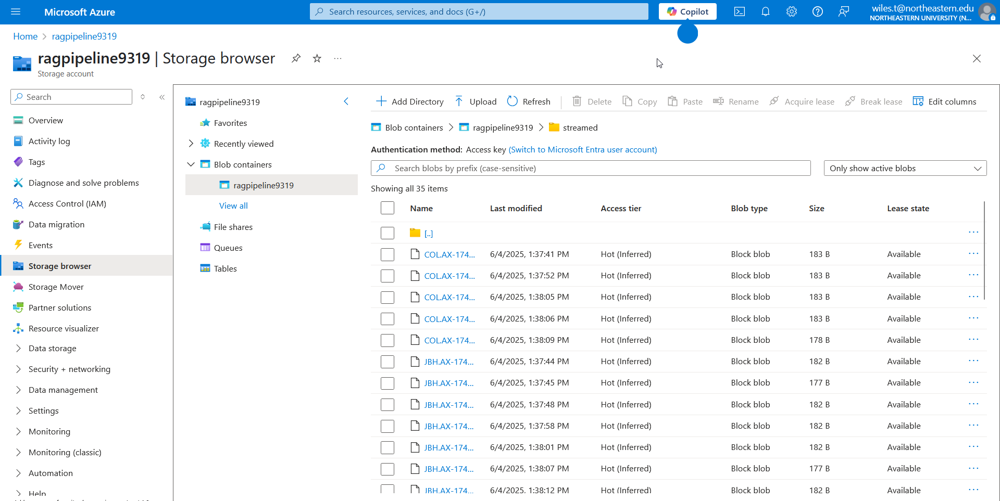

# Streaming Data

# Running the Pipeline
```shell
poetry lock
poetry install
poetry run python src\yahoo_ws.py
```

^^^ assuming you have your .env at the root folder up to date with Azure credentials.

### Schema for JSON Uploaded to Azure Blob Storage
```json
{
    'security': string,
    'price': float,
    'changePercent': float,
    'tradeVolume': int,
    'isMarketOpen': boolean,
    'marketStatus': string,
    'timestamp': iso_timestamp
}
```




### Basic S3 CLI Commands

This is deprecated, we're no longer using S3... just here for reference.

```
# list all JSON uploads
aws s3 ls s3://ragproject-store/streamed/

# wipe it all
aws s3 rm s3://ragproject-store/streamed/ --recursive

# grab total size
aws s3 ls s3://ragproject-store/streamed/ --recursive --human-readable --summarize | grep "Total"
```