# RAG Benchmark System Architecture - Mermaid UML

## Complete System Architecture Diagram

```mermaid
graph TB
    %% External Data Sources
    subgraph EXT ["External Data Sources"]
        YF[Yahoo Finance API]
        YLT[YLiveTicker WebSocket<br/>Real-time Financial Stream]
    end

    %% Client Layer
    subgraph CLIENT ["Client Layer"]
        WEB[Web Dashboard<br/>Streamlit UI]
        API_CLIENTS[API Clients<br/>External Applications]
        CURL[cURL/Postman<br/>Direct API Testing]
    end

    %% API Gateway Microservice
    subgraph GATEWAY ["API Gateway :8000"]
        direction TB
        FASTAPI[FastAPI Server<br/>Request Routing]
        FLASK[Flask Routes<br/>Legacy Support]

        subgraph ENDPOINTS ["API Endpoints"]
            EP1["/api/query<br/>General RAG Queries"]
            EP2["/api/financial/query<br/>Financial-Specific Queries"]
            EP3["/api/metrics<br/>System Metrics & Export"]
            EP4["/api/benchmark<br/>Performance Testing"]
        end

        GRPC_CLIENT_EMB[gRPC Client<br/>→ Embeddings Service]
        GRPC_CLIENT_LLM[gRPC Client<br/>→ LLM Service]
        METRICS_COLLECTOR[Enhanced Metrics Collector<br/>CSV Export & Analytics]
    end

    %% Embeddings Microservice
    subgraph EMBED_SVC ["Embeddings Service :50051"]
        direction TB

        subgraph STREAMING ["Streaming Pipeline - Real-time"]
            STREAM_LISTENER[Financial Data Streamer<br/>YLiveTicker Consumer]
            CHUNKER[Text Chunker<br/>RecursiveCharacterTextSplitter<br/>1000 chars, 200 overlap]
            EMBEDDER[Embedding Model<br/>sentence-transformers/<br/>all-MiniLM-L6-v2<br/>384-dim vectors]
            MULTI_DB[Multi-Database Writer<br/>Parallel Vector Storage]
        end

        subgraph GRPC_EMB ["gRPC Service - On-demand"]
            GRPC_EMBED[gRPC Server<br/>RAGServiceServicer]
            QUERY_EMBED[Query Embedding<br/>Similarity Search]
            BENCHMARK_EMBED[Benchmark Service<br/>Performance Testing]
        end

        subgraph METRICS ["Metrics & Monitoring"]
            STREAM_METRICS[Streaming Metrics Collector<br/>4 Component CSV Exports]
            AUTO_EXPORT[Auto CSV Export<br/>Every 30s]
        end
    end

    %% LLM Microservice
    subgraph LLM_SVC ["LLM Service :50054"]
        direction TB

        subgraph MODEL_MGR ["Model Management"]
            LLM_MANAGER[LLM Manager<br/>Model Loading & Switching]
            MODEL_LLAMA[Llama 3.2-1B-Instruct<br/>Apple Silicon MPS Optimized]
            ROPE_PATCH[RoPE Scaling Patch<br/>MPS Compatibility Fix]
        end

        subgraph PROMPTS ["Prompt Engineering"]
            PROMPT_MGR[Prompt Manager<br/>Financial Templates]
            SYS_PROMPTS[System Prompts<br/>Context-Bounded Analysis]
            FIN_PROMPTS[Financial Prompts<br/>Stock/Market Analysis]
        end

        subgraph GENERATION ["Generation Pipeline"]
            GRPC_LLM[gRPC Server<br/>RAGServiceServicer]
            RAG_PIPELINE[RAG Pipeline<br/>Vector + LLM Integration]
            RESPONSE_GEN[Response Generation<br/>~3.2s Apple Silicon]
        end
    end

    %% Database Layer
    subgraph DATABASES ["Vector Database Layer"]
        direction LR
        CH[ClickHouse<br/>Primary Vector Store<br/>Real-time Financial Data]
        PG[PostgreSQL<br/>pgvector Extension<br/>Alternative Storage]
        OS[OpenSearch<br/>Vector Search Engine<br/>Optional Adapter]
        CASS[Cassandra<br/>Distributed Storage<br/>Optional Adapter]
    end

    %% AI/ML Components Detail
    subgraph AIML ["AI/ML Pipeline Components"]
        direction TB

        subgraph TEXT_PROC ["Text Processing Pipeline"]
            TC1[Raw Financial JSON<br/>~800 chars average]
            TC2[Character-based Chunking<br/>Preserves Document Structure]
            TC3[Single Chunk per Ticker<br/>0.02-0.05ms processing]
        end

        subgraph VECTOR_GEN ["Vector Generation Pipeline"]
            VG1[MiniLM-L6-v2 Model<br/>90MB, 22M parameters]
            VG2[384-dimensional Vectors<br/>~80-100 iterations/second]
            VG3[Cosine Similarity Search<br/>Sub-second retrieval]
        end

        subgraph LLM_PROC ["LLM Processing Pipeline"]
            LP1[Llama 3.2 Architecture<br/>1B parameters optimized]
            LP2[Apple Silicon MPS<br/>Native GPU acceleration]
            LP3[Financial Context Injection<br/>3000 character limit]
        end
    end

    %% Performance Metrics
    subgraph PERF ["System Performance Metrics"]
        PERF1[Data Ingestion: ~1ms<br/>Chunking: 0.02-0.05ms<br/>Embedding: 12-50ms]
        PERF2[Vector Storage: 67-410ms<br/>Similarity Search: ~290ms<br/>LLM Generation: ~3.2s]
        PERF3[End-to-End Latency: 3.54s<br/>Throughput: 80-100 it/s<br/>Apple Silicon: 10x speedup]
    end

    %% Configuration & Environment
    subgraph CONFIG ["Configuration & Orchestration"]
        ENV[Environment Variables<br/>.env Configuration]
        DOCKER[Docker Compose<br/>Multi-service Orchestration]
        MAKE[Makefile Build System<br/>make setup/start/stop]
    end

    %% Data Flow - Streaming Path (Real-time)
    YLT -.->|"WebSocket Stream<br/>145+ Financial Tickers"| STREAM_LISTENER
    STREAM_LISTENER -->|"Raw JSON Data"| CHUNKER
    CHUNKER -->|"Text Chunks"| EMBEDDER
    EMBEDDER -->|"384-dim Vectors"| MULTI_DB
    MULTI_DB -->|"Parallel Insert"| CH
    MULTI_DB -.->|"Optional Write"| PG
    MULTI_DB -.->|"Optional Write"| OS
    MULTI_DB -.->|"Optional Write"| CASS

    %% Data Flow - Query Path (On-demand)
    WEB -->|"HTTP Requests"| FASTAPI
    API_CLIENTS -->|"REST API Calls"| FASTAPI
    CURL -->|"Direct HTTP"| FASTAPI

    FASTAPI --> EP1
    FASTAPI --> EP2
    FASTAPI --> EP3
    FASTAPI --> EP4

    EP1 -->|"General Query"| GRPC_CLIENT_LLM
    EP2 -->|"Financial Query"| GRPC_CLIENT_LLM
    EP3 -->|"Metrics Request"| METRICS_COLLECTOR
    EP4 -->|"Benchmark Request"| GRPC_CLIENT_EMB

    GRPC_CLIENT_LLM -->|"gRPC Call"| GRPC_LLM
    GRPC_CLIENT_EMB -->|"gRPC Call"| GRPC_EMBED

    GRPC_LLM -->|"Vector Search Request"| RAG_PIPELINE
    RAG_PIPELINE -->|"Query for Embedding"| QUERY_EMBED
    QUERY_EMBED -->|"Similarity Search"| CH
    CH -->|"Relevant Financial Context"| RAG_PIPELINE
    RAG_PIPELINE -->|"Context + User Query"| RESPONSE_GEN

    %% Model Integration Flow
    LLM_MANAGER --> MODEL_LLAMA
    MODEL_LLAMA --> ROPE_PATCH
    PROMPT_MGR --> SYS_PROMPTS
    PROMPT_MGR --> FIN_PROMPTS
    RESPONSE_GEN --> MODEL_LLAMA

    %% Metrics Collection Flow
    STREAM_LISTENER -.->|"Performance Data"| STREAM_METRICS
    CHUNKER -.->|"Chunking Metrics"| STREAM_METRICS
    EMBEDDER -.->|"Embedding Metrics"| STREAM_METRICS
    MULTI_DB -.->|"Database Metrics"| STREAM_METRICS
    STREAM_METRICS --> AUTO_EXPORT

    %% Configuration Flow
    ENV -.->|"Runtime Config"| GATEWAY
    ENV -.->|"Runtime Config"| EMBED_SVC
    ENV -.->|"Runtime Config"| LLM_SVC
    DOCKER -.->|"Container Orchestration"| GATEWAY
    DOCKER -.->|"Container Orchestration"| EMBED_SVC
    DOCKER -.->|"Container Orchestration"| LLM_SVC

    %% Pipeline Detail Connections
    TC1 --> TC2
    TC2 --> TC3
    VG1 --> VG2
    VG2 --> VG3
    LP1 --> LP2
    LP2 --> LP3

    %% Styling
    classDef microservice fill:#e1f5fe,stroke:#01579b,stroke-width:3px
    classDef database fill:#f3e5f5,stroke:#4a148c,stroke-width:3px
    classDef aiml fill:#e8f5e8,stroke:#1b5e20,stroke-width:3px
    classDef external fill:#fff3e0,stroke:#e65100,stroke-width:3px
    classDef client fill:#fce4ec,stroke:#880e4f,stroke-width:3px
    classDef config fill:#f1f8e9,stroke:#33691e,stroke-width:2px
    classDef performance fill:#fff8e1,stroke:#ff8f00,stroke-width:2px

    class GATEWAY,FASTAPI,FLASK microservice
    class EMBED_SVC,GRPC_EMBED,STREAM_LISTENER microservice
    class LLM_SVC,GRPC_LLM,LLM_MANAGER microservice
    class CH,PG,OS,CASS database
    class CHUNKER,EMBEDDER,MODEL_LLAMA,PROMPT_MGR aiml
    class YF,YLT external
    class WEB,API_CLIENTS,CURL client
    class ENV,DOCKER,MAKE config
    class PERF1,PERF2,PERF3 performance
```



## How to Use This Diagram

### 1. **Copy & Paste into Mermaid Tools:**
- [Mermaid Live Editor](https://mermaid.live/)
- GitHub/GitLab (supports mermaid natively)
- Notion, Obsidian, or any mermaid-compatible tool

### 2. **Embed in Documentation:**
```markdown
```mermaid
[paste the code above here]
```
```

### 3. **Export Options:**
- **PNG/SVG**: From mermaid.live
- **PDF**: Print from browser
- **Embed**: Direct markdown integration

## Diagram Components

### **Color Coding:**
- 🔵 **Blue**: Microservices (API Gateway, Embeddings, LLM)
- 🟣 **Purple**: Databases (ClickHouse, PostgreSQL, etc.)
- 🟢 **Green**: AI/ML Components (Models, Chunkers, Embedders)
- 🟠 **Orange**: External Services (Yahoo Finance, YLiveTicker)
- 🔴 **Pink**: Client Applications (Web UI, API Clients)
- 🟤 **Brown**: Configuration & Orchestration

### **Flow Types:**
- **Solid Lines**: Primary data/control flow
- **Dotted Lines**: Configuration, monitoring, optional paths
- **Labeled Arrows**: Specific data types and protocols

### **Performance Metrics Included:**
- Real measured latencies from your system
- Throughput specifications
- Component-specific timing breakdowns
- End-to-end performance characteristics

This diagram serves as your **complete system blueprint** - perfect for documentation, presentations, team onboarding, or technical reviews.